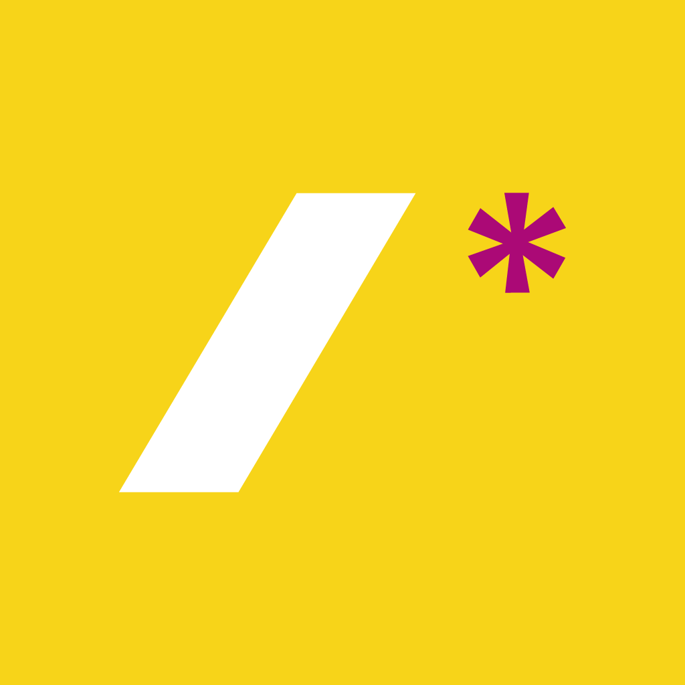
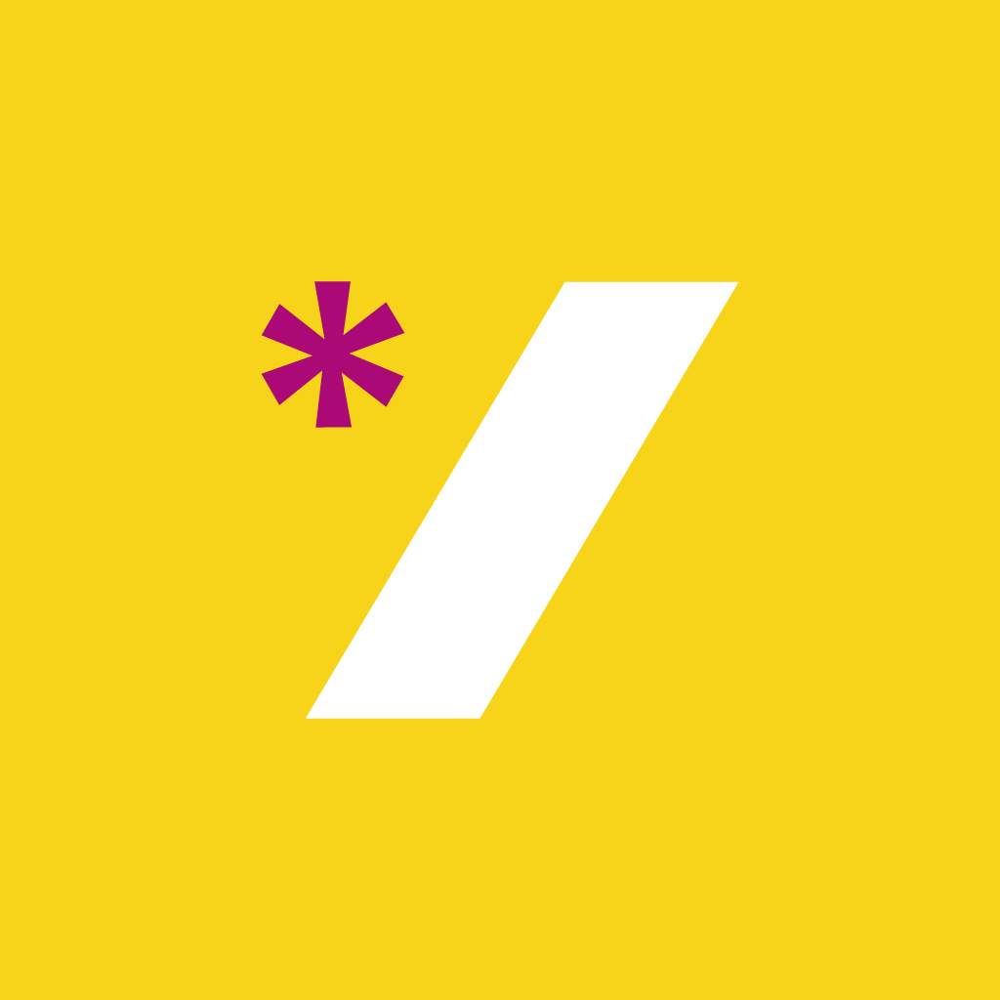
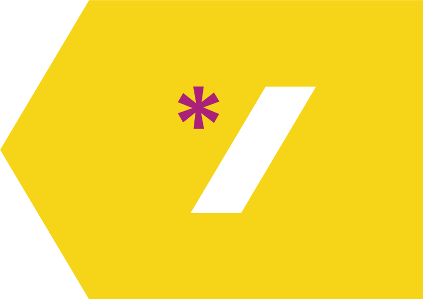
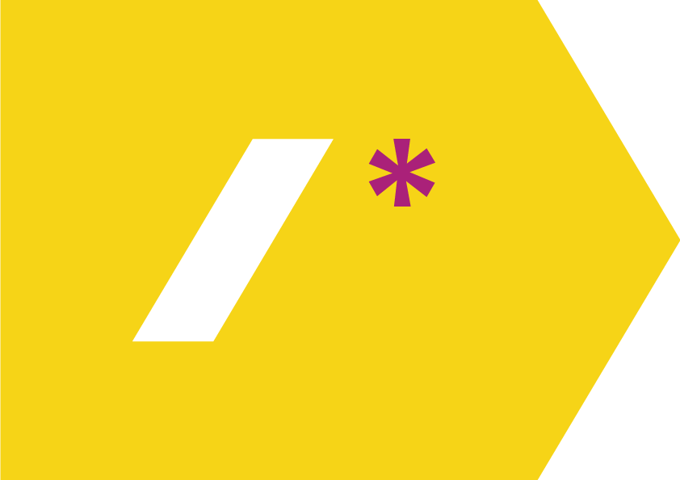

# Стиль для pitera11y_meetup

[Шрифт Gotham Pro](https://github.com/Seafnox/Gothampro).

## Цвета

- Баклажановый: `#ab0976`
- Жёлтый: `#f7d419`
- Цвет текста: `#060606`

## Логотип

Открывающий: [SVG](logo/open.svg) или [PNG](logo/open.png) (1024 × 1024)

Закрывающий: [SVG](logo/close.svg) или [PNG](logo/close.png) (1024 × 1024)

[Исходник](logo/logo.ai) (RGB) и [наклейки](logo/logo.ai) (CMYK) в AI

## Страницы

Верхний баннер для Вконтакте: [PNG](pages/vk-top.png) или [PSD](pages/vk-top.psd)

Правый баннер для Вконтакте: [PNG](pages/vk-right.png) или [PSD](pages/vk-right.psd)

Баннер для Фейсбука: [PNG](pages/facebook.png) или [PSD](pages/facebook.psd)

## События

- [Анонс митапа в соцсетях](events/social.psd)
- [Анонс доклада в соцсетях](events/talk.psd)
- [Фоновая картинка для десктопа](events/desktop.psd)
- [Шаблон для фотографии](events/photo.psd)

## Стрелки

Стрелки для указателей: [PDF](arrows/arrows.pdf) или [AI](arrows/arrows.ai) (CMYK)

